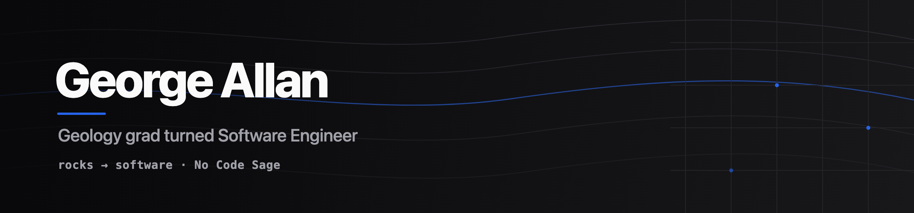

  

  

  
  
  

## About Me

I'm a software engineer at **No Code Sage**, an AI-first engineering consultancy — and I got here without a CS degree.

I studied **Geology** (BSc, University of Southampton), then taught myself to code the practical way. It started with crypto trading systems — first in PineScript, then graduating to real Python by getting AI to translate my own scripts. Three years of side projects later, while working as a geotechnical engineer, I built an app that turned muddy, handwritten borehole field notes into structured `.ags` data using an AI handwriting model. That's when it clicked: the thing I built on weekends for free was the thing I should be paid to do on a Monday.

- Working across a TypeScript monorepo every day, building with AI agents
- Self-taught the long way round: rocks → trading bots → production software
- Big on doing things the correct, secure way over the quick hack

<table>
  <tr>
    <td width="50%" valign="top">
      <h3>What I'm About</h3>
      <ul>
        <li>Secure, correct code over quick hacks</li>
        <li>Understanding the <em>why</em> behind every decision</li>
        <li>Shipping things &mdash; done beats perfect</li>
      </ul>
    </td>
    <td width="50%" valign="top">
      <h3>The Roundabout Path</h3>
      <ul>
        <li>BSc Geology &mdash; University of Southampton</li>
        <li>Geotechnical Engineer &mdash; Ian Farmer Associates (RSK)</li>
        <li>Associate Software Engineer &mdash; No Code Sage</li>
      </ul>
    </td>
  </tr>
</table>

## Projects

### Quore Geotechnical — *instant, client-ready site intelligence*

The product that turned me from a geotechnical engineer into a software engineer. Field crews used to scrawl borehole logs on paper that came back to the office mud-smeared and half-illegible, then someone retyped it all by hand into HoleBASE / OpenGround — hours per site. Quore kills that loop: snap a photo of the site notes, an **AI handwriting model** extracts the data, and the app exports standards-compliant **`.ags`** files straight into the industry databases. No retyping.

### Furniture Friends — *AI inventory management for a local charity*

A pro-bono build for **Furniture Friends**, a Datchworth charity that gives donated furniture a second home. I replaced their manual stock-keeping with an **AI-powered inventory management** system, so the volunteers can track what's come in, what's available, and where it's gone without the spreadsheet wrangling.

## Core Stack

### Languages

### Frameworks & Runtime

### Data & Infra

### Tools & Workflow

## GitHub Activity

  

